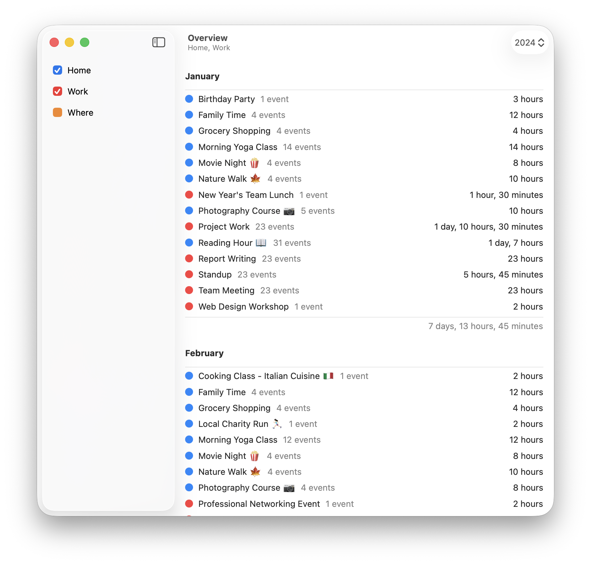

# Overview

[](https://github.com/jbmorley/overview/actions/workflows/build.yaml)

Generate monthly durations for similarly named calendar events.



## Development

### Builds

Overview follows the version numbering, build and signing conventions for InSeven apps. Further details can be found [here](https://github.com/inseven/build-documentation).

Release builds are created on GitHub Actions using 'build.sh' in the 'scripts' directory. This script is primarily focused on setting up the environment for testing and signing. Local builds can be performed using the  Xcode project found in the 'macOS' directory.

### Tests

It's helpful to be able to manually walk through the full Calendar authorisation flows before release. This authorisation can be reset using the following command, which should allow for testing the first-run experience:

```bash
tccutil reset Calendar uk.co.jbmorley.apps.overview
```

### Documentation

Documentation is built with [Jekyll](https://jekyllrb.com) and deployed at https://overview.jbmorley.co.uk.

Jekyll can be used to serve the documentation locally for testing:

```bash
cd docs
gem install
bundle exec jekyll serve
```

## Licensing

Overview is licensed under the MIT License (see [LICENSE](LICENSE)). It depends on the following separately licensed third-party libraries and components:

- [Diligence](https://github.com/inseven/diligence), MIT License
- [Glitter](https://github.com/inseven/glitter), MIT License
- [Interact](https://github.com/inseven/interact), MIT License
- [Licensable](https://github.com/inseven/licensable), MIT License
- [Material Icons](https://github.com/google/material-design-icons), Apache License
- [Sparkle](https://github.com/sparkle-project/Sparkle), Sparkle License
